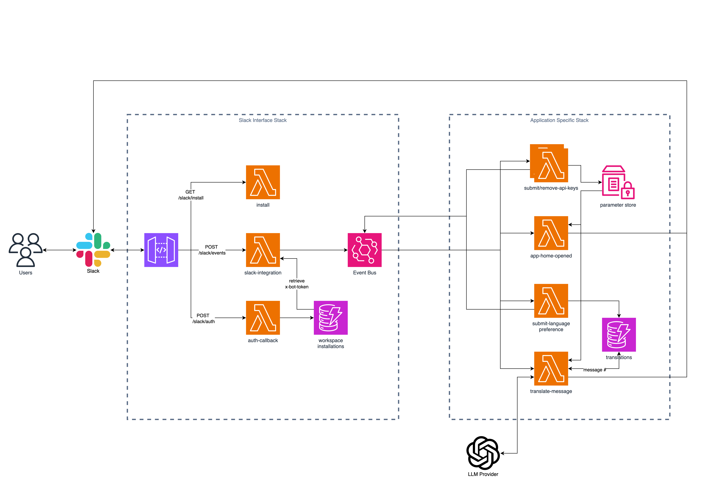
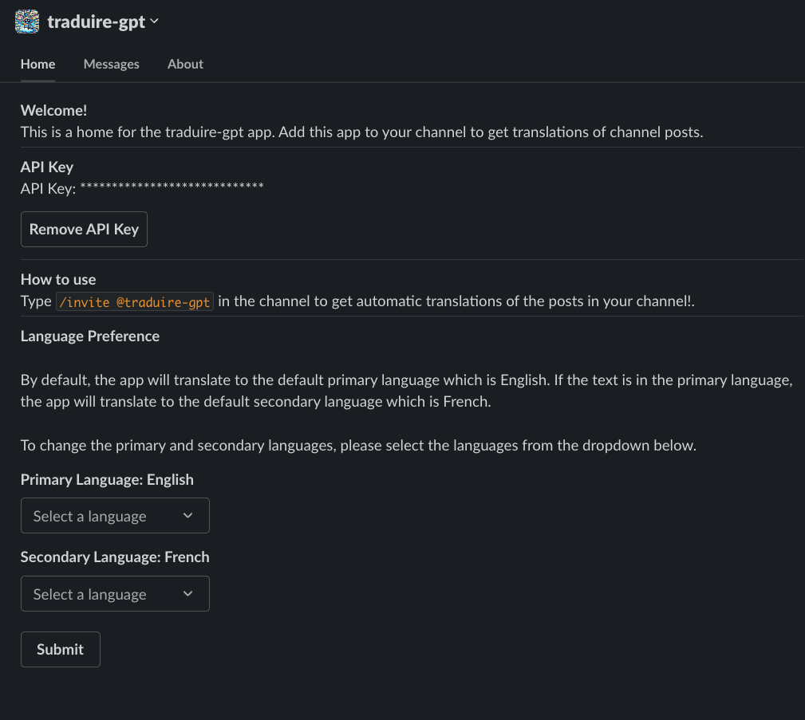
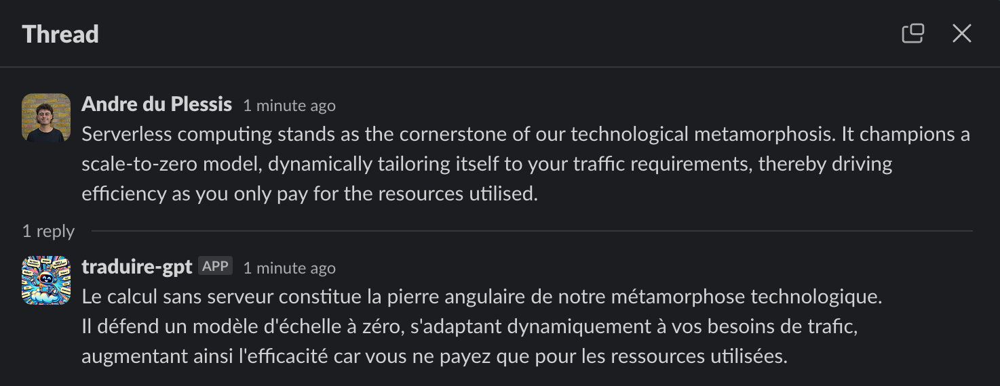

# Event-Driven Slack Application

This project demonstrates how to build a custom Slack application using serverless event-driven architectures on AWS to enable cross organizational communication within a multilingual teams by providing real-time message translation.

The interaction between deployed infrastructure and Slack is handled using the Javascript Bolt framework, which simplifies the process of building Slack apps by providing a simple and intuitive API for handling events and actions.

This application can be downloaded to your Slack workspace using this link:

## Overview

The application is triggered by Slack events that are routed through AWS EventBridge to relevant Lambda functions, which handle different actions like opening the app home, translating messages and setting language preferences. This setup allows for scaling without the complexity of managing a dedicated server, offering a robust solution for enhancing the functionality of Slack within an organization.

## Architecture

The architecture of the application is as follows:

## Setup & Deployment

### Prerequisites

- AWS account
- Slack account with permissions to create apps in the workspace
- Node.js and pnpm installed
- AWS CLI installed and configured

### Configuring Slack App

1. Create a Slack app by following the [Slack API Hello World tutorial](https://api.slack.com/tutorials/hello-world-bolt)
2. Copy and past the manifest file from the `slack-app-manifest.json` file in this repository to the app settings.
3. Note the `SLACK_CLIENT_ID`, `SLACK_CLIENT_SECRET` and the `SLACK_SIGNING_SECRET` from the Slack app settings.

### Deploying the Backend

1. Clone this repository.
2. Navigate to the cloned directory and run `pnpm install` to install dependencies.
3. Have your aws credentials configured in your environment.
4. Deploy the application using using the command `pnpm ci:deploy -c stage=dev`.
5. Note the api endpoint from the output of the deployment.

### Linking Slack App to Backend

1. In the App Manifest file, update the <api-endpoint> with the actual API endpoint.
2. To install the app to your workspace, visit the site `<api-endpoint>/slack/install` in your browser. You will be redirected to Slack to authorize the app.

## Usage

Once deployed and configured, the application will look something like this:

You can submit or remove an OpenAI API key or update the language preference in the app home.
You can add the app to a channel by running the command `/invite @traduire-gpt` in the channel.
The app will automatically translate messages sent in channels based on the language preference set by the user.
The language preferences will translate any language to your primary language. If the orginal message is in your primary language, it will be translated to the secondary language.

## Contributing

Contributions are welcome! Feel free to open issues or submit pull requests to enhance the functionality of this Slack application.

## Authors

- **Andre du Plessis** - _Initial work_ - [jaduplessis](https://github.com/jaduplessis)

---

Enjoy building your event-driven Slack applications!

---
